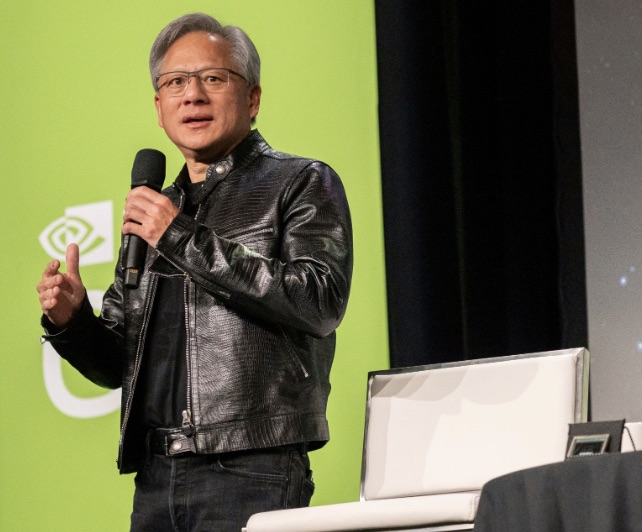

## NVIDIA CEO Jensen Huang's Strategic Vision and Recent Initiatives

Jensen Huang, CEO of NVIDIA, has strategically positioned the company at the forefront of AI technology. His recent public appearances and interviews provide insights into his leadership approach and the future direction of NVIDIA.

### Strategic Initiatives and Vision:
- **AI Democratization:** At the GTC 2023 keynote, Huang highlighted NVIDIA's efforts to bring AI capabilities to every industry through accessible AI supercomputers like the DGX Cloud. These initiatives leverage partnerships with major cloud providers like Microsoft Azure, Google Cloud, and Oracle Cloud Infrastructure to enhance the availability and scalability of AI tools [source](https://blogs.nvidia.com/blog/gtc-keynote-spring-2023/).
  
- **Advancing Software 3.0:** Huang has introduced the concept of Software 3.0, where AI significantly transforms software and hardware landscapes. NVIDIA's comprehensive AI stack, including large language models and services, is central to this vision, indicating a shift towards a more integrated AI ecosystem that spans both hardware and software [source](https://www.enterpriseai.news/2023/06/28/nvidia-ceo-huang-get-ready-for-software-3-0/).

- **Strategic Partnerships:** Collaborative efforts with tech giants aim to expand NVIDIA's AI functionalities. These partnerships support the deployment and scaling of AI applications, aligning with Huang's vision of integrated and widespread AI utilization [source](https://blogs.nvidia.com/blog/gtc-keynote-spring-2023/) [source](https://www.enterpriseai.news/2023/06/28/nvidia-ceo-huang-get-ready-for-software-3-0/).

- **Innovation in Technology:** Huang's focus extends beyond commercial AI applications to critical areas like healthcare and generative AI, demonstrating NVIDIA's commitment to using AI to solve complex, real-world problems [source](https://blogs.nvidia.com/blog/gtc-keynote-spring-2023/).

### Recent Developments:
- **AI and Computing Leadership:** In recent discussions, Huang expressed that AI is driving a new era in computing, with NVIDIA playing a pivotal role. His leadership is marked by an emphasis on innovation in AI training, deployment, and infrastructure, preparing NVIDIA to lead in the evolving technological landscape [source](https://www.youtube.com/watch?v=_-wjA4XlBl4).

Jensen Huang's leadership is evidently shaping NVIDIA into a key player in AI and computing, continuously pushing the boundaries of technology to innovate and transform industries globally.

For more comprehensive details, you can access Jensen Huang's recent keynote addresses and interviews on [NVIDIA's Blog](https://blogs.nvidia.com/) and [YouTube](https://www.youtube.com/watch?v=_-wjA4XlBl4).
