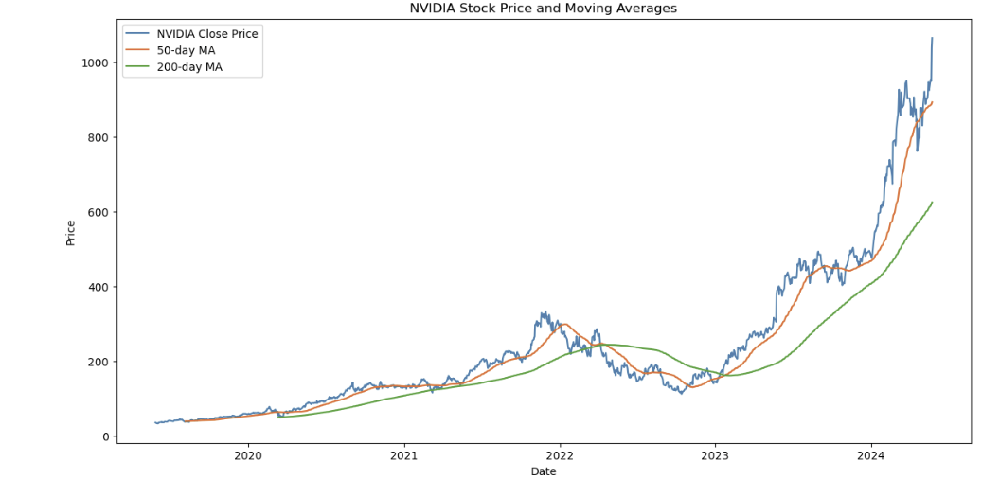
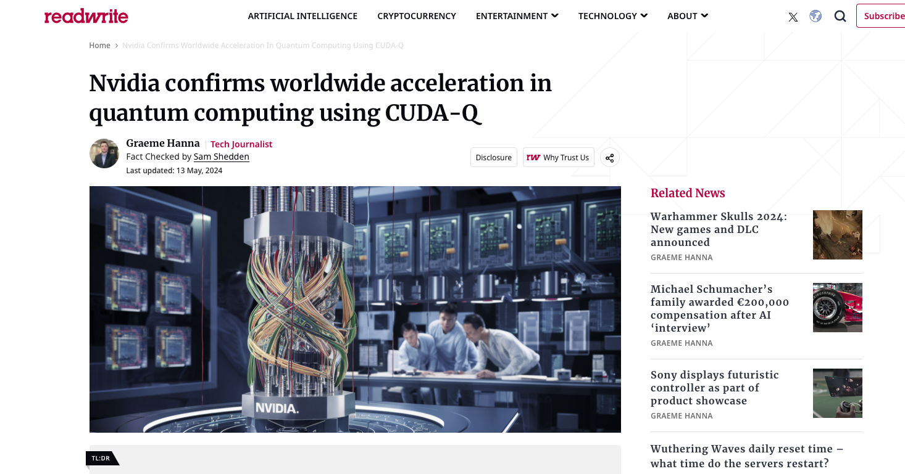
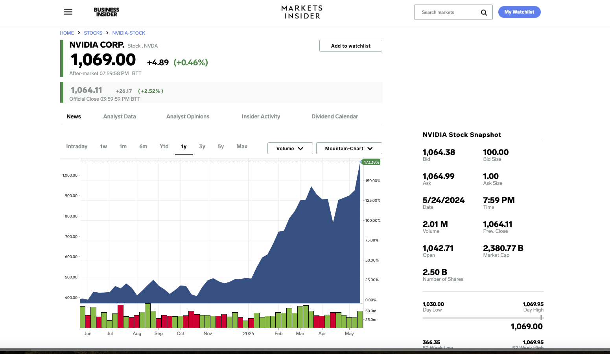

# NVIDIA_Financials
Quick glance about the NVIDIAs previous financial statements and news in the last 2-3 years.

## Preliminary - EDA

## Current News

## NVIDIA Stock and Financial Highlights (2024)
First Q1 report will be on May 22, 2024

## NVIDIA Stock and Financial Highlights (2023)

### Key Financial Highlights:
- **Revenue Growth:** NVIDIA reported a staggering revenue of $22.1 billion in Q4 of fiscal 2024, marking a 265% increase from the previous year. The full-year revenue stood at $60.9 billion, up by 126% [source](https://nvidianews.nvidia.com/news/nvidia-announces-financial-results-for-fourth-quarter-and-fiscal-2024).
- **Profitability:** Significant improvements were noted in net income and gross profit margins, with non-GAAP measures adjusted for various non-recurring costs to provide a clearer financial picture [source](https://nvidianews.nvidia.com/news/nvidia-announces-financial-results-for-fourth-quarter-and-fiscal-2024).

### Analyst Insights and Future Outlook:
- **AI and Semiconductor Leadership:** NVIDIA is pivotal in the AI microchips sector, producing about 70% of the chips used globally in AI applications, bolstering their financial success and technological dominance [source](https://investorplace.com/2023/11/why-the-skys-the-limit-for-nvidia-stock/).
- **Strategic Developments:** Innovations such as the H100 GPU and ventures into robotics and AI-enhanced digital ads highlight NVIDIA's strategic direction [source](https://investor.nvidia.com/news/press-release-details/2023/NVIDIA-Hopper-GPUs-Expand-Reach-as-Demand-for-AI-Grows/default.aspx).
- **Analyst Ratings and Targets:** Post-earnings, analysts have expressed optimism, with upgrades in ratings and price targets, expecting robust growth driven by AI and data center sales [source](https://finance.yahoo.com/news/nvidia-stock-explodes-after-guidance-for-the-ages-what-wall-street-is-saying-120105455.html).

### Challenges and Considerations:
- **Geopolitical Tensions:** Regulatory challenges affecting AI chip exports to China have impacted revenues, though the overall financial impact is expected to be manageable [source](https://investorplace.com/2023/11/why-the-skys-the-limit-for-nvidia-stock/).

NVIDIA's positioning in the AI boom and its semiconductor industry leadership suggest a promising outlook, albeit with potential geopolitical risks and market volatility.

For more detailed insights, check NVIDIA's [investor relations website](https://investor.nvidia.com/home/default.aspx) or financial news platforms like [Yahoo Finance](https://finance.yahoo.com/).

---
